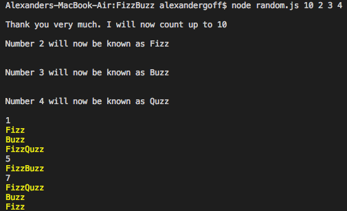

# My FizzBuzz game

## Try number 1 - index.js

In my first try I decided to go with the code structure that allows you to set values and then check for them. I somewhat remembered what Tom Scott's solution was ( https://www.youtube.com/watch?v=QPZ0pIK_wsc ) and it felt like the most sensible so I did that. 

To run it simply download this file and call it in the console - `node index.js`

## Try number 2 - random.js
Less another try, more an expansion. I have made this now work dynamically. When running the script you must pass at least two variables: 

* the number you want to count up to
* the number(s) you want to be replaced

You can put as many numbers as you like (realistically 441) afterwards and they will be replaced by auto-generated names.

It works by generating a random name, then checks the name isn't used, then plays FizzBuzz with that name.

The script will only return Consonant beginning words. I want non-sensical words but not unpronouncable ones - Xuzz is borderline.

One word of warning, Jizz was a possible name. If you see any more slightly suspect words, just place them into the taken names array and they will no longer appear. You could also put Xuzz and Xizz in there if you like. 